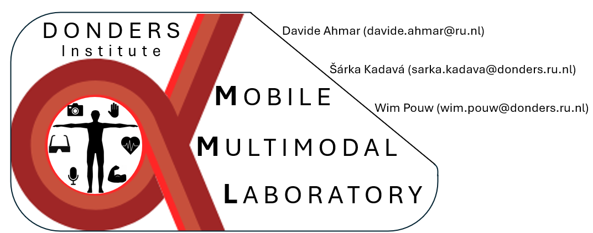
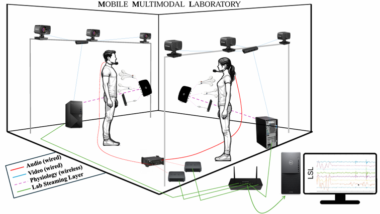

# MobileMultimodalLab
### *An Open-Source, Low-Cost and Portable Laboratory for the study of Multimodal Human Behavior*

**MML releases:**
- [] **v0.1** Published paper
- [] **v0.2** Published code

------

 

## Contents

1. [Introduction](#introduction)
2. [Currently supported (tutorialed) equipment](#currently-supported-tutorialed-equipment)
3. [Repository structure](#repository-structure)
4. [How to get started](#how-to-get-started)
4. [How to cite](#how-to-cite)
5. [How to contribute](#how-to-contribute)

 

## Introduction

**MobileMultimodalLab (MML)** is a project initiated by researchers at Donders Center for Cognition. It aims to provide a lab setup for anyone interested in studying multimodal interactive behaviour - including acoustics, body movement, muscle activity, eye movements, and so on.

To achieve this, we are working on a comprehensive coding library, accompanied by a practical manual, that shall help researchers to build their own MobileMultimodalLab. Our guiding principles are:
- **Open-source resources** - All code and documentation is freely available to everyone
- **Low-cost equipment** - We want to build the setup with as little monetary cost as possible (i.e., less than 10K)
- **Portable setup** - The setup should be easily transportable across locations

The MML setup currently consists of
- **multiple frame-synced 2D cameras** that allow for 3D motion tracking
- **multiple microphones** for acoustic analysis
- **multiple physiological sensors** for measuring heart rate, muscle activity, and respiration

*Figure 1: Schematic representation of the MobileMultimodalLab setup*

 

Additionally, the setup is build in a modular way, so that anyone can remove sensors they do not need, or potentially add new ones that the default version does not include.

To ensure that all the signals are synchronized, we use the Lab streaming layer (https://github.com/sccn/labstreaminglayer), a software that synchronizes different data streams with sub-millisecond precision, crucially simplifying the data collection process and subsequent processing.

 

## Currently scripted (tutorialed) equipment & software

- Two microphones for audio recording (with amplifier)
- Three cameras per participant (6 in total) for motion tracking
- Two Biosignal PLUX devices (ECG, EMG and respiration)
- Two Neon Eye-tracking devices
- Lab streaming layer for synchronization

 

## Repository structure

<pre><b>Github repository</b>                 
├── 1_LAB_SETUP                     # experiment setup
│   ├── xxx
├── 2_PREPROCESSING                 # data preprocessing
│   ├── 0_XDF_Viewer
│   ├── 1_XDF_PROCESSING
│   └── 3_MOTION_TRACKING       

└── xxx </pre>

 

## How to get started

*to be added*

 

## How to cite

*to be added*

 

## How to contribute

*to be added*